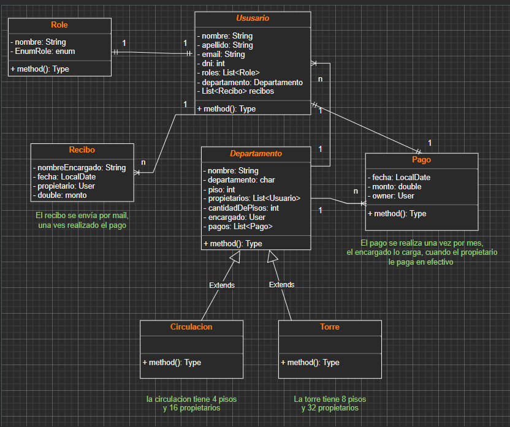

<h1>Control de expensas</h1>

Sistema que controla las expensas de un barrio.
 

<strong>Funcionalidades:</strong>

<ol>
    <li>El usuario propietario y encargado se pueden registrar.</li>
    <li>El usuario propietario y encargado se pueden loguear</li>
    <li>El propietario puede ver sus pagos y de los demas propietarios.</li>
    <li>El pago se realiza una vez por mes, cuando el propietario le abona en efectivo al encargado 
    este lo carga al pago y se le envia un mail con el recibo de dicho pago al propietario.</li>
</ol>
 
<h2>UML</h2>

